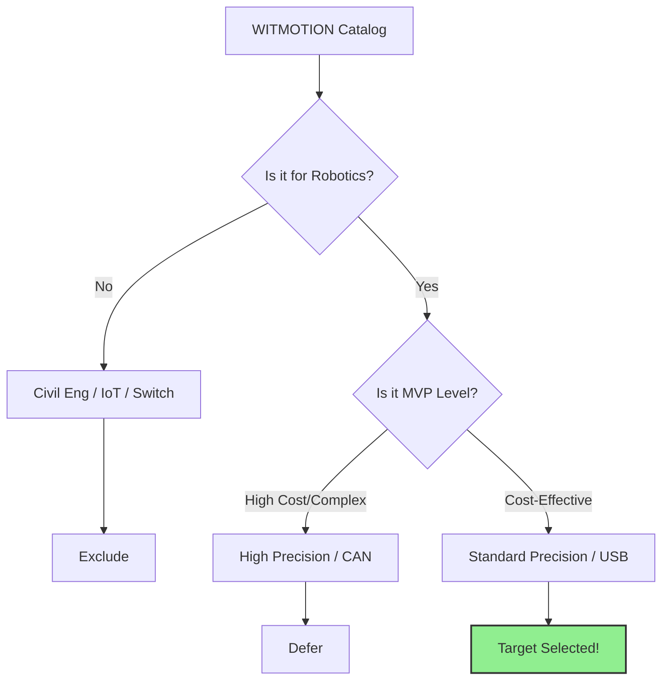
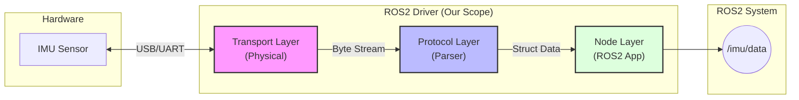

# Modern ROS2 WIT IMU Driver DevLog
## Part 2. Hardware Selection and Explainable Architecture

## 1. Introduction: Inside the Maze of Datasheets

WITMOTION's sensor lineup is vast and fragmented. In this post, we establish criteria for targeting specific models to build a **'Universal ROS2 Driver'** and document the process of designing the software architecture to translate this into code.

> **Resource Link** 
> [🔗 WIT Official Brochure & Catalog Drive](https://drive.google.com/drive/folders/1yd63KANaY-ITdjffk2aC6ud01yJp5FOh){: .btn .btn--info}
{: .prompt-info }

### 1.1 Goal and Selection Criteria: MVP

Supporting every sensor and every protocol would be ideal for a 'product', but this is a personal 'project'. Our goal is to create a **Minimum Viable Product (MVP)** that can be applied to robots most quickly and efficiently. Therefore, our selection criteria are strictly based on **'Practicality for Robotics'**.

### 1.2 Classification by Series: What to Buy, What to Skip

Among the numerous series in the catalog, I have classified them into those meaningful for robot developers and those that are not.

| Category     | Series                   | Decision | Reason                                            |
| :----------- | :----------------------- | :------: | :------------------------------------------------ |
| **Excluded** | **Ultra-High Precision** |    ❌     | Too sensitive to vibration. High cost.            |
| **Excluded** | **IoT Series**           |    ❌     | Latency issues with WiFi/LTE.                     |
| **Excluded** | **Tilt Switch**          |    ❌     | Only provides On/Off signals.                     |
| **Target**   | **Standard Precision**   |    ✅     | **Best C/P for Sensor Fusion.** (0.1°~0.5° error) |
| **Target**   | **Digital Inclinometer** |    ✅     | Direct digital output (No ADC needed).            |
| **Target**   | **Tilt Module**          |    ✅     | Bare-metal for mass production.                   |
| **Deferred** | **High Precision**       |    ⚠️     | Different protocols, lower cost-performance.      |

### 1.3 Classification by Function: 6-Axis or 9-Axis?

Defining the functions to be supported in the MVP driver phase.

#### 1.3.1 Target Functions
* **Acceleration:** Measuring gravitational and motion acceleration.
* **Angular Velocity:** Measuring rotation rate. **(Most Critical)**
* **Angle (Euler/Quaternion):** Pose values calculated by the sensor's internal fusion algorithm.

#### 1.3.2 Deferred Functions
* **Magnetometer:** In indoor environments, 'Hard/Soft Iron' distortion caused by steel structures or motors creates significant noise. Requires complex calibration.
* **Barometer:** Altitude data is insignificant for UGVs and noisy due to airflow.

### 1.4 Classification by Interface: How to Connect?

The scope of support for physical connection methods (Transport).

#### 1.4.1 Supported
* **USB (Virtual COM) / TTL / RS232**
    * Most convenient and versatile for development.
    * Although HW differs, they share the same **Serial Interface** in SW.

#### 1.4.2 Deferred
* **I2C / SPI:** Embedded-only. Not suitable for PC-based ROS2.
* **CAN / RS485:** Requires specific hardware (CAN Transceiver) and SocketCAN mechanism. *Reserved for future expansion.*

---

## 2. Establishing Architecture: Towards "Explainable Code"

Beyond simply writing a `while` loop to `read()` data, we aim for a structure that is **extensible and explainable**. To achieve this, we separate the driver into three layers.

### 2.1 Data Pipeline

1.  **Transport Layer (Physical Layer):**
    * **Role:** Handles "How is it connected?"
    * Reads a 'Byte Stream' regardless of connection type (USB, Serial, CAN).
2.  **Protocol/SDK Layer (Interpretation Layer):**
    * **Role:** Handles "What is the content?"
    * Parses bytes according to protocol specs and converts to data structures.
3.  **ROS2 Node Layer (Application Layer):**
    * **Role:** Handles "How will we use it?"
    * Packages data into `sensor_msgs/Imu` and publishes as a Topic.

> **Why separate layers?** 
> This follows the **Separation of Concerns** principle. Even if we switch from USB to CAN, we only need to replace the Transport Layer. The rest remains reusable. This is Engineering.
{: .prompt-tip }

### 2.2 Transport Layer: Diversity and Selection

While hardware interfaces vary, we actively utilize the powerful abstraction features of the Linux operating system.

**"Everything is a File"**
In a Linux environment, whether physically connected via a USB port or via TTL on a board pin header, everything is abstracted as a **'Serial Device File'** at the kernel level.

* **USB Connection:** `/dev/ttyUSB*` or `/dev/ttyACM*`
* **UART/RS232 Connection:** `/dev/ttyS*` or `/dev/ttyAMA*`

Therefore, the Transport Layer is designed with a simple **'Open & Read'** structure using the **Standard POSIX Serial API**.

> **"What if I want to use CAN?"**
> Don't worry. Since we separated the layers in section 2.1, you can simply add a `CanTransport` class later without touching the existing logic. This is the power of design.

### 2.3 Protocol Layer: One Code for All Sensors

A key advantage of WITMOTION sensors is that many models share the same protocol. Whether you use the `WT901S` or `WT901B`, the data packet structure (Header: `0x55`) remains the same. Therefore, the Protocol Layer acts as a **Universal Parser**, covering dozens of sensor types with a single codebase.

### 2.4 ROS2 Node Layer: Modern & Standard

We hide complex logic within the SDK layer, allowing the Node layer to focus strictly on being **'ROS2-native'**.

* **Lifecycle Node:** Ensuring connection stability (`configure` -> `activate` -> `deactivate`).
* **Standard Topic:** Using standard `sensor_msgs/Imu` for maximum compatibility.

## **[Closing: Development Philosophy: Depth-First Development]**

Why did we ruthlessly filter out so many sensor models and features in the previous sections? This decision is based on my engineering philosophy: **"Depth-First Development."**

When building a system from scratch, it is tempting to design for every possible scenario (Breadth-First). However, my experience suggests that establishing a solid end-to-end pipeline first is far more effective.

### **Why Depth-First?**

1.  **Agility in Refactoring:** No initial architecture is perfect. If we implement a wide range of features based on a flawed structure, refactoring becomes a nightmare. By keeping the initial implementation "thin" (focusing on a single vertical flow), we can easily fix structural issues before they propagate.
2.  **Scalability after Validation:** Once the core pipeline (Transport → Protocol → ROS2 Node) is validated with a minimal set of features, adding "flesh" (supporting more sensors) becomes a trivial task of repetition.

### **The Pareto Principle in Robotics**
The **Pareto Principle (80/20 Rule)** applies heavily to robotics hardware.
* **20% of the sensor models** cover **80% of robotic use cases**.
* We focus on that core 20% first to achieve 80% of the value.
* **Edge cases** and niche sensors should only be addressed *after* the core system is stable.

In the next post, **Part 3**, we will finally open the IDE. We will set up the project environment and implement the **Transport Layer** code based on the architecture designed today.

> **"Build the skeleton first. The flesh can wait."**